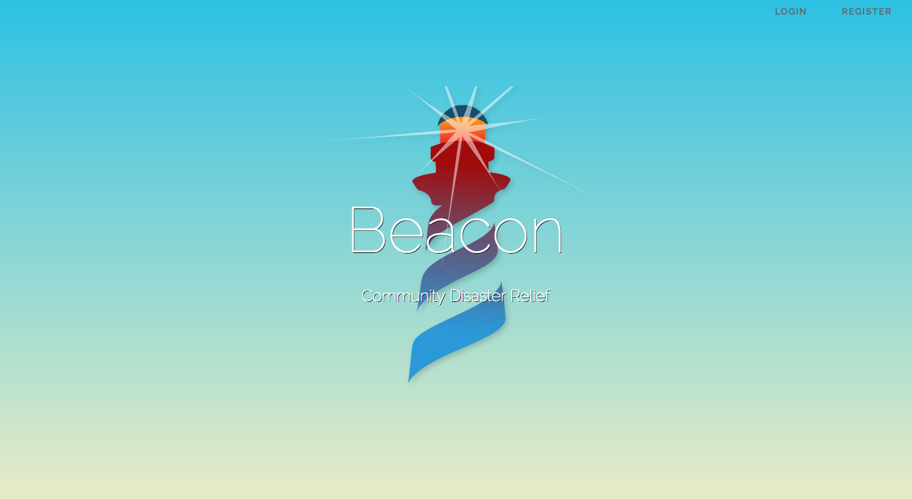

# Beacon

### A Community Forum for Disaster Relief

#### One of the most difficult parts of rebuilding after a natural disaster is connecting members of a community to help address the biggest needs in that area. Many people spend a large portion time trying to connect with friends and neighbors to figure out where they can help to begin the recovery process. Beacon seeks to give communities a platform to begin the recovery process. Beacon offers a live stream forum for community members in the same zip code to alert others of dangerous condition in the area, volunteer recovery efforts, or their own request for assistance after a disaster. 

#### Screenshots

#### Creating Beacon:

###### When I began working on Beacon, I wanted to explore using technologies that would be new to me and would challenge me to learn a new stack during the development process. I chose to use PHP with the Laravel MVC-framework, as well as a MySQL database. I found the learning curve for Laravel was pretty low, and it helped me to better understand PHP and how it differs from JavaScript. It has been an extremely beneficial experience for me, and has helped me to solidfy many of the development concepts that I was still struggling with. 

###### Taking this approach to the development process did pose a few problems. Not having much experience with PHP, and none with Laravel, it was more difficult to troubleshoot any bugs or issues that came up. However, after spending a day going over the documentation for Laravel, I was able to quickly pick up speed. There is an amazing community for Laravel online, and some of the best documentation/tutorials I could have asked for. Taking the time to really dig in to the framework made it much easier to conquer some of the biggest challenges of past projects.

###### I also wanted to approach this project in a way that would allow me to continue building it as a personal project. To do this, I needed to set a solid foundation to start. The first hurdles to jump were authentication and hosting. Once I had those completed, I was able to build a basic structure similiar to a blog format. Creating User, Post, and Comment models to work with. Laraval's CLI allowed me to create each model along with it's controller and database migration simultaneously. I was also able to easily create the three main components of the home layout and include them in the parent component very quickly, using bootstrap to align them correctly. With each component in a separate view, this will allow me to restructure the visual layout as the app evolves. 

#### Planning Process

##### Wireframes

##### User Stories
[Beacon Trello Board](https://trello.com/b/u0CrgD33/beacon)

#### Future of Beacon
There are many features that I will be working to incorporate into Beacon. Several of the features I hope to add are:	Geolocation of user rather than entered zip code, Ability for user to broadcast Geo-tags, Google Maps API integration for Geo-tags and directions to users in need, and an emergency broadcast options for users who need immediate assistance(tied to Geo-tag for emergency response units to access). I also hope to integrate live voice chat channel feature to allow for real time communication between users and emergency services. 

### Check out the app!
[Beacon](https://quiet-headland-93649.herokuapp.com/)
